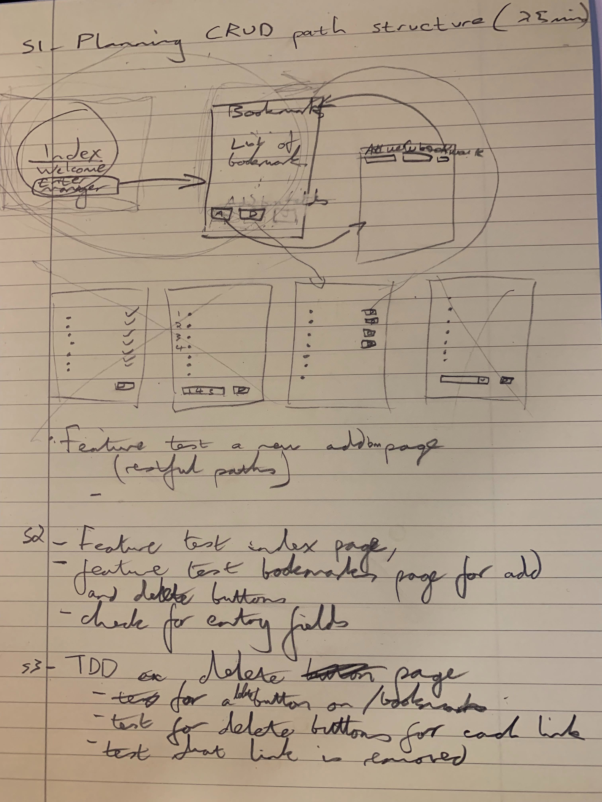

# BOOKMARK MANAGER

* The website will have the following specification:

    * Show a list of bookmarks
    * Add new bookmarks
    * Delete bookmarks
    * Update bookmarks
    * Comment on bookmarks
    * Tag bookmarks into Categories
    * Filter bookmarks by tag
    * Users are restricted to manage only their own bookmarks

We'll be using a Behaviour Driven Development (BDD) cycle (i.e. outside-in testing: Capybara first).


Objects:
* Bookmark
	* Add
	* Display
	* Delete
	* Filter
	* Categories
	* Update
	* Comment

User story 1
```
As a time-pressed user
So that I can save a website
I would like to add the site's address and title to bookmark manager.
```
## MVC Diagram


### User story 2
``` 
As a time-pressed user
So that I can have a list of bookmarks
I want to be able to add bookmarks.
```

### User story 3
```
As a user
So that I can remove a bookmark
I want to have an option to choose which bookmark to delete.
```

* Using the DELETE method in html is not fully supported, so:
  * we need to enable :method_override
  ```
  enable :method_override
  ```
  * we add a hidden input
  ```
    <input type='hidden' name='_method' value='DELETE'>
  ```
  * pass the query to action
  ```
  <form action='/bookmarks/<%=bookmark.id%>' method='post'>
  ```
  * we use that query in the controller
  ```
  delete '/bookmarks/:id' do
    Bookmark.delete_from_database(params[:id])
  ```




### User story 4
```
As a user,
So that I can update a bookmark,
I want to be able to edit a bookmark.
```

## INSTRUCTIONS FOR THE USE OF SQL:

1. Connect to psql in the terminal

```
$ psql
```
2. Create the database using the psql command

```
CREATE DATABASE bookmark_manager
```
3. Connect to the database using the pqsl command 

```
\c bookmark_manager
```

4. To set up the appropriate tables, connect to the database in `psql` and run the SQL scripts in the `db/migrations` folder in the given order.

```
CREATE TABLE bookmarks(id SERIAL PRIMARY KEY, url VARCHAR(60));
```
```
ALTER TABLE bookmarks ADD COLUMN title VARCHAR(60);
```

### To run the Bookmark Manager app:

```
$ rackup
```

### To view bookmarks, navigate to `localhost:9292`.

### To run tests:

```
$ rspec
```

### To run linting:	

```
rubocop
```